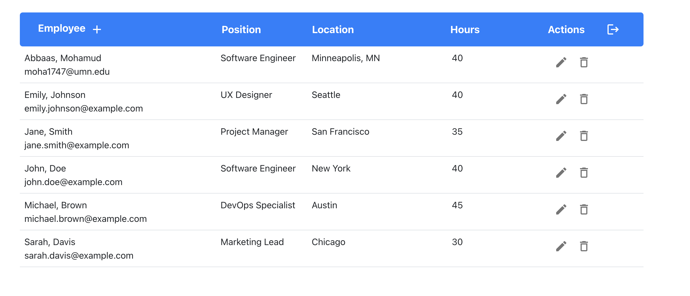
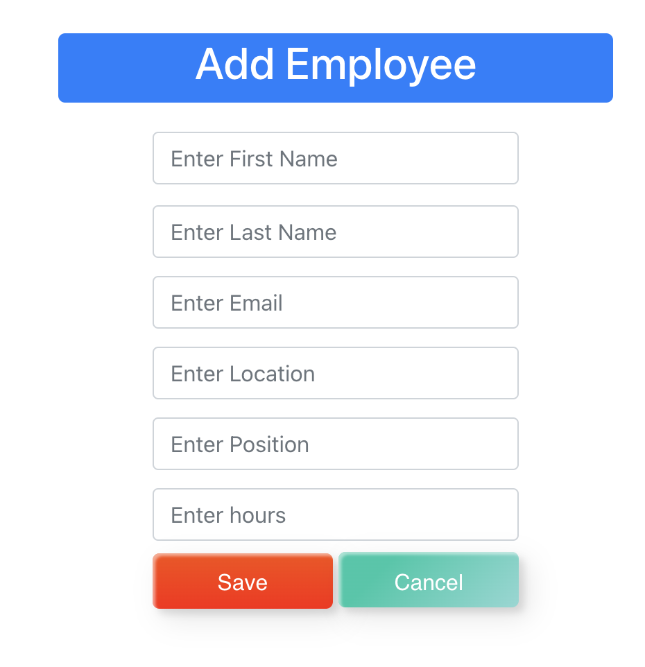
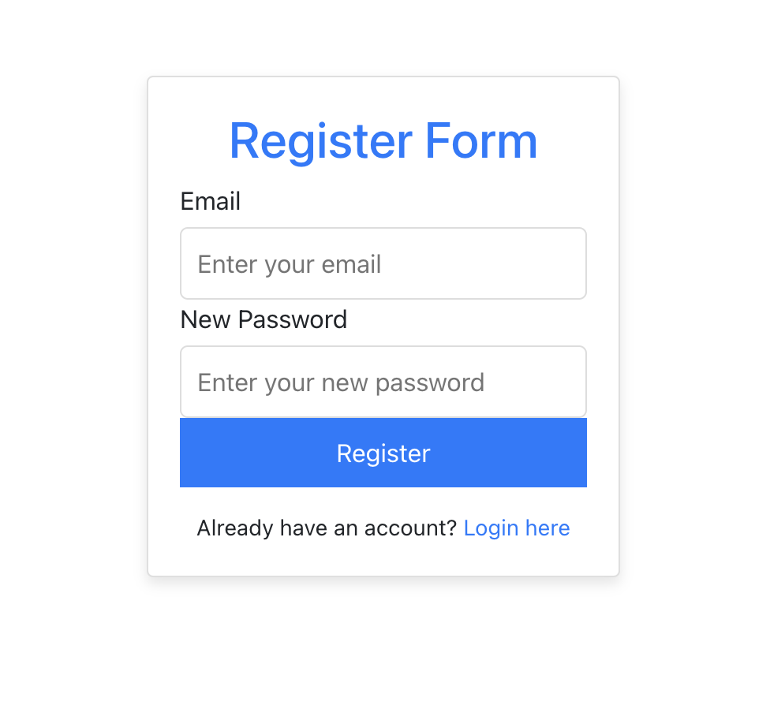

# Employee Management System

This is a full-stack application for managing employees. It consists of a backend server built with Spring Boot for the backend and a frontend client built with React for the frontend.

## Installation

### Backend (Spring Boot)
### Frontend (React + Material UI)
### Database (MySQL)

1. Clone the repository:
   ```bash
   git clone https://github.com/your-username/employee-management.git
2. Start the backend: The backend server will start on `http://localhost:8080`.
  ```bash
  cd employeemanagmentbackend
  mvn clean install # Please make sure you have maven installed
  navigate to EmployeemanagmentbackendApplication and run on your IDE
```
3. Start the frontend: The frontend application will be available on `http://localhost:3000`.
  ```bash
  cd employeemanagmentfrontend
  cd src
  npm install
  npm start
```

#### Reason for Stopping AWS Usage
Due to limited resources and the ongoing costs associated with maintaining AWS services, the decision was made to stop using EC2 and RDS. This was necessary to manage expenses effectively and explore alternative hosting solutions. As of now the only way I can showcase this project is through local set up.

### Screenshot of Different states of my Application






